# River Side Food Court - User Flow Documentation

## Overview

This document describes the user flows for the three main user types in the River Side Food Court system: Customers, Vendors, and Cashiers. The system uses a QR code-based table ordering system with real-time order tracking.

## System Architecture Overview

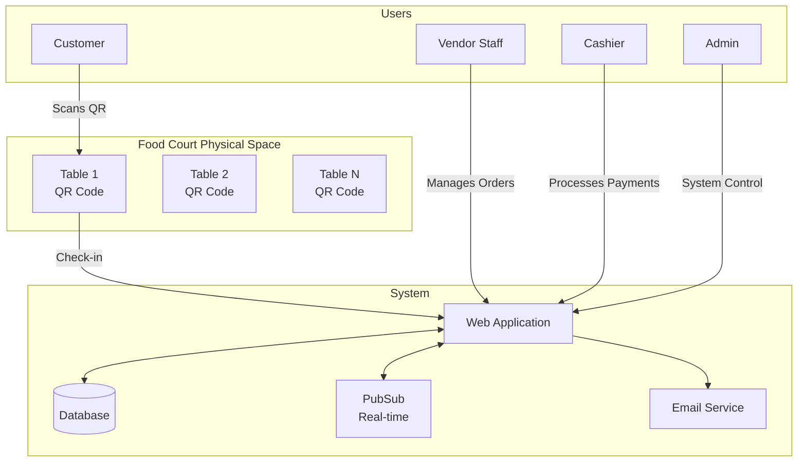

## 1. Customer Flow

### 1.1 Complete Customer Journey

```mermaid
flowchart TD
    Start([Customer Enters Food Court])
    
    Start --> FindTable[Find Available Table]
    FindTable --> ScanQR[Scan QR Code on Table]
    
    ScanQR --> CheckIn{Check-in Page}
    CheckIn --> EnterPhone[Enter Phone Number]
    EnterPhone --> EnterName[Enter Name - Optional]
    EnterName --> ConfirmCheckIn[Confirm Check-in]
    
    ConfirmCheckIn --> TableOccupied[Table Status: Occupied]
    TableOccupied --> ViewMenu[View Menu Page]
    
    ViewMenu --> SelectVendor[Select Vendor Tab]
    SelectVendor --> BrowseItems[Browse Menu Items]
    BrowseItems --> SelectItem{Select Item?}
    
    SelectItem -->|Yes| AddToCart[Add to Cart]
    AddToCart --> MoreItems{Add More Items?}
    MoreItems -->|Yes| SelectVendor
    MoreItems -->|No| ViewCart[View Cart]
    
    SelectItem -->|No| MoreVendors{Browse Other Vendors?}
    MoreVendors -->|Yes| SelectVendor
    MoreVendors -->|No| ViewCart
    
    ViewCart --> ReviewOrder[Review Order Details]
    ReviewOrder --> PlaceOrder[Place Order]
    
    PlaceOrder --> OrderCreated[Order Created<br/>Status: Pending]
    OrderCreated --> TrackOrder[Order Tracking Page]
    
    TrackOrder --> WaitVendor[Wait for Vendor Accept]
    WaitVendor --> OrderPreparing[Status: Preparing]
    OrderPreparing --> OrderReady[Status: Ready]
    
    OrderReady --> GoToCashier[Go to Cashier Counter]
    GoToCashier --> ShowOrderNumber[Show Order Number]
    ShowOrderNumber --> PayCashier[Pay at Counter]
    PayCashier --> OrderPaid[Status: Paid]
    
    OrderPaid --> CollectFood[Collect Food from Vendor]
    CollectFood --> OrderCompleted[Status: Completed]
    
    OrderCompleted --> ContinueDining{Continue Dining?}
    ContinueDining -->|Order More| ViewMenu
    ContinueDining -->|Finish| CheckOut[Check Out]
    CheckOut --> TableAvailable[Table Released]
    TableAvailable --> End([Leave Food Court])
```

### 1.2 Customer State Transitions

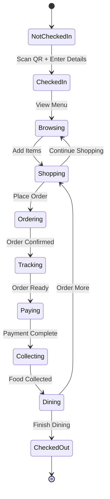

## 2. Vendor Flow

### 2.1 Vendor Operations Flow

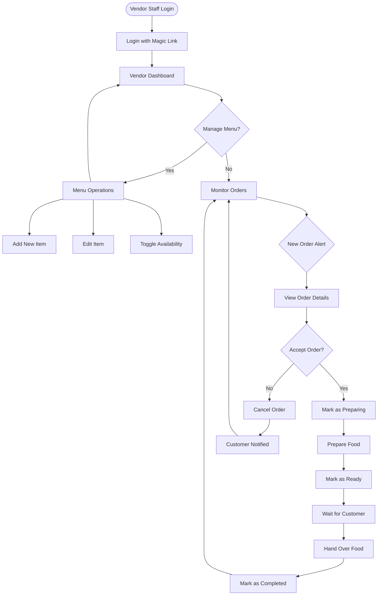

### 2.2 Vendor Order State Management

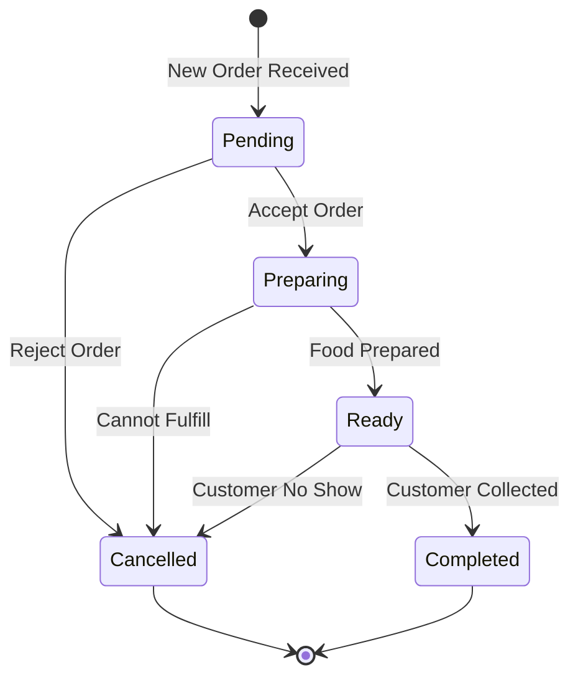

## 3. Cashier Flow

### 3.1 Cashier Payment Processing Flow

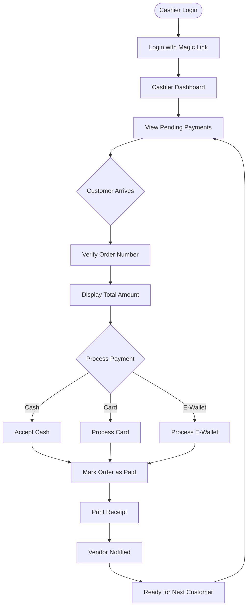

### 3.2 Payment State Flow

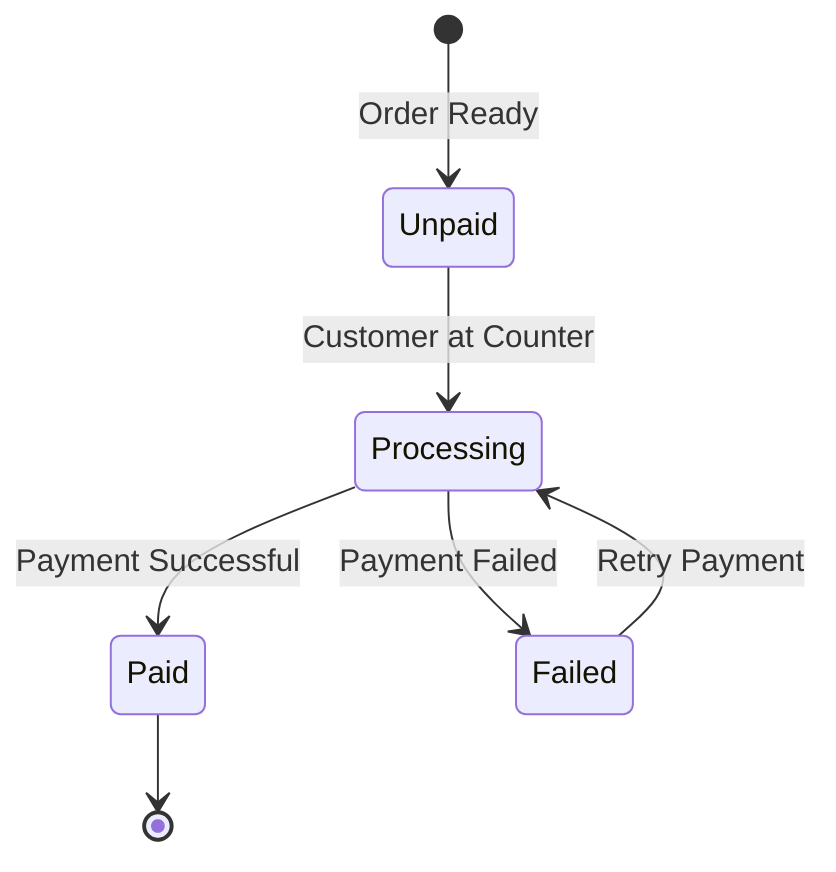

## 4. Real-time Communication Flow

### 4.1 PubSub Event Flow

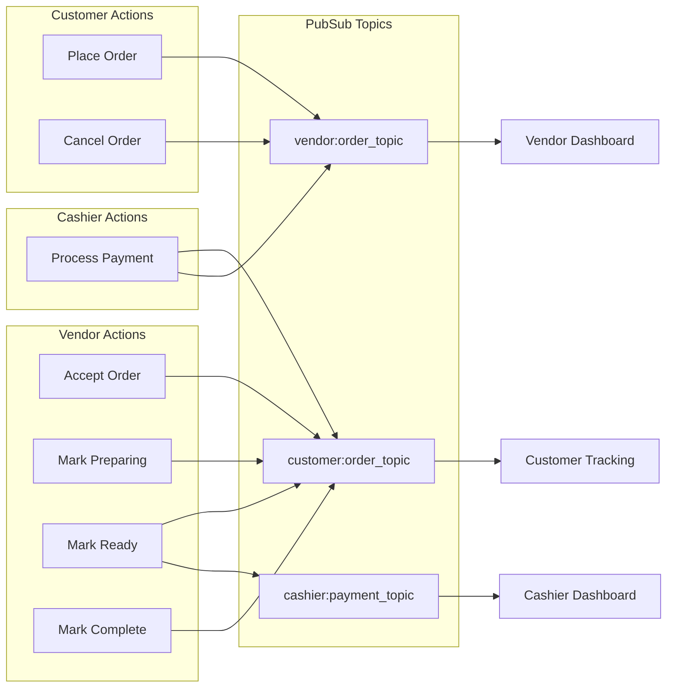

## 5. Authentication Flow

### 5.1 Magic Link Authentication

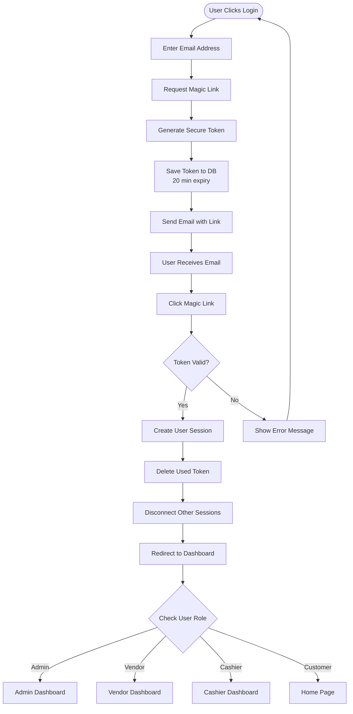

## 6. Order Lifecycle

### 6.1 Complete Order Flow

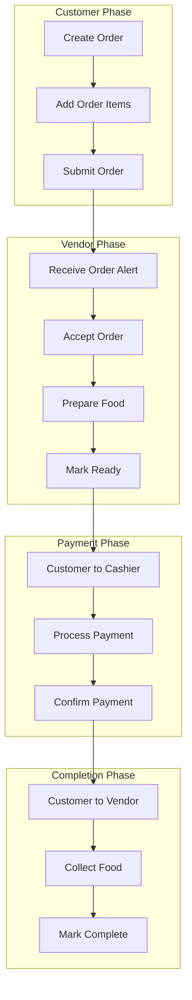

### 6.2 Order Status Transitions

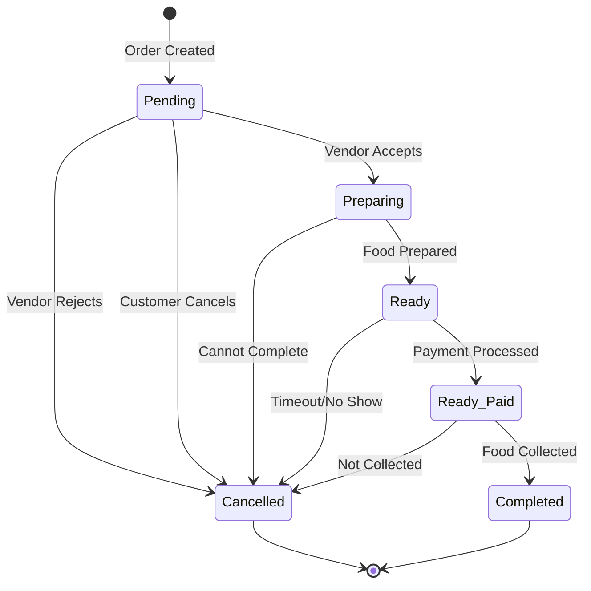

## 7. Error Handling Flows

### 7.1 Common Error Scenarios

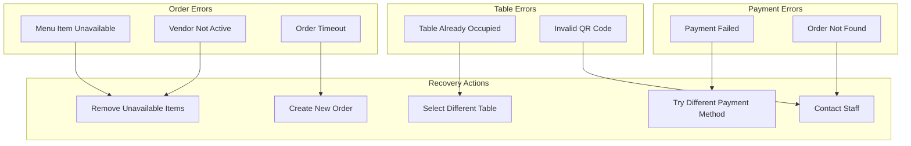

## 8. Administrative Flows

### 8.1 Admin System Management

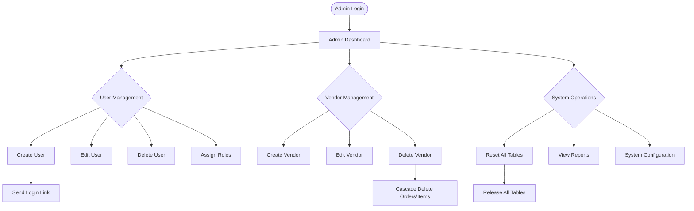

## 9. Data Flow Summary

### 9.1 Key Data Relationships

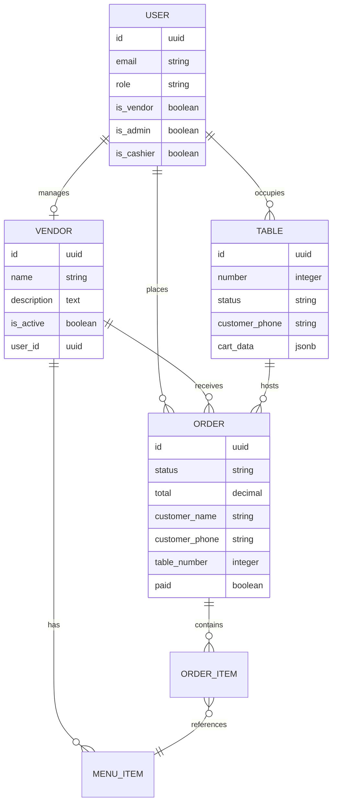

## Best Practices

### For Customers
1. Always check out when leaving to free the table
2. Keep order number handy for payment
3. Monitor order status for timely collection

### For Vendors
1. Accept/reject orders promptly
2. Update order status accurately
3. Keep menu items availability current

### For Cashiers
1. Verify order details before payment
2. Ensure receipt is provided
3. Handle payment failures gracefully

### For Admins
1. Regular monitoring of system health
2. Prompt user support for issues
3. Maintain data integrity with cascade operations